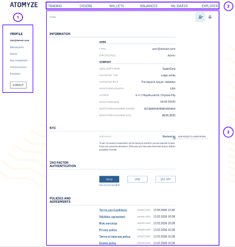

# 1. Introduction

The Atomyze platform – a digital platform for
the secure tokenization and trading of industrial and financial assets. ([https://atm-front-shared.atm-dev.n-t.io](https://atm-front-shared.atm-dev.n-t.io/))

## 1.1. Atomyze platform interface

The profile of the Atomyze platform interface
indicated below:

 `Screen 1. The
Atomyze platform interface`

The User’s profile consists of several blocks:

● The first block  (on the left hand side of the Screen 1)
contains the following information:

○ Bank accounts

○ Devices

○ Keys management

○ Change password

○ Employees

● The second block (on
the top of the Screen 1) contains the information about modules:

○ Trading

○ Orders

○ Wallets

○ Issuances

○ Validator

○ Explorer

Modules availability
depends on the User’s role. For instance, if the administrator provides the
user with advanced functionality, the user will see Issuances or Validator in
the profile.

● The third block (at
the center of the Screen 1) contains the following information:

○ User information

○ KYC

○ 2FA (2ND FACTOR AUTHENTICATION)

○ POLICIES AND AGREEMENTS

## 1.2. Users of the Atomyze platform

Atomyze users can operate as legal entities
(participants) and employees (members of legal entities). At the first stage,
Atomyze users can only be employees of legal entities.

To become an Atomyze user it is necessary for
a legal entity to have a current account in any lending institution (Bank).

## 1.3. Required Knowledge and Skills

The user must have skills in working with computer
equipment, email programs, mobile devices, and applications in them.

## 1.4. User roles

Currently, the roles at the employee level
are:

● Administrator

● Manager

Administrator and Manager roles cannot be
overlapped. The difference between these two roles lies in the fact that only
Administrator can provide other employees with the AP rights.

In order to become the User of the platform,
employees and legal entities should pass KYC procedure and get access to the
platform by obtaining the invitation.

At the level of legal entities (participants)
the functionality is provided to the following roles:

● The General member

● The Issuer

● The Validator

● The Industrial client

● ETC company

The General member role is automatically
assigned to any registered member. The assignment of the specialized member
roles (Issuer, Validator,Industrial client and ETC company) is configured by
the Platform Administrator in the admin panel.

Roles at the participant level can overlap,
that is, the same legal entity participant can, in addition to the general
role, perform all or several specialized roles. The exception is the ETC
company.

In accordance with the further stages of
development, the functionality and responsibility of the roles will be more
detailed.

## 1.5. Prerequisites

Admin Panel is a web application, accessible
through a web browser with an active internet connection.

At the current stage of AP development the
recommended web browser is Google Chrome. In accordance with the further stages
of development, the range of web browsers will be wider for user’s convenience.
